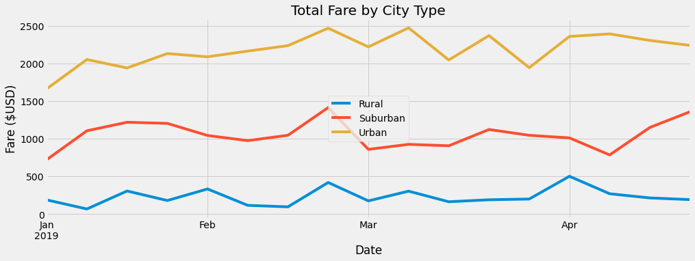

# _Let's Take A Ride_ || PyBer, Ride-Share App  Analysis

## Overview of Project

PyBer, a ride-share app, is looking to expand its reach by improving accessibility to ride-sharing services, and set affordability, primarily to areas otherwise underserved.

Thusly, an analysis of the former's ride-share activity was conducted on data from January to early May of 2019, consisting of fares, number of rides, number of drivers by date (and time) and _per_ city type: Rural, Suburban, Urban, respectively. 

A second analysis consisted of a more focused or granular look on the fares by city type. 

Analysis is accompanied by visual aids as can be seen below and found [here.](https://github.com/SoWhitIs/pyber-analysis/tree/main/analysis)

### Resources
* Data Source (s): city_data.csv, ride_data.csv

* Software: Python 3.7.6 64-bit | Python Libaries: Pandas,  Matplotlib, SciPy | Jupyter Notebook** | Anaconda

  *  Data Access: Workaround, [Project Jupyter: jupyter nbviewer](https://nbviewer.jupyter.org/), a Jupytner Notebook renderer **
     *    Data may not display properly on GitHub, please use provided workaround

## Results

  <i><b> PyBer Summary, By the Numbers, Per City Type  </b></i> 
 

  

**When reviewing the _PyBer Summary_ as a whole _we can see_ (chart below):**

* While Rural ridership _is_ significantly less than that of the Urban ridership, on average, fares cost **$10 more**. 

* The number of drivers in Urban Cities **far exceed** riders in the same geographic region, edging out with over 50%. 
_(Noted impact in Figure 7, right)_  

* In Suburban Cities, on average drivers made about **$9 more _than_** the cost of the average ride. 

***
***
 **On the other hand, when review of data illustrated in the below _PyBer  Total Fares, Per City Type, (Resampled, By Week)_ line graph _we can see_**:

* Ridership in _all_ geographic regions took a dip in at the end of February after having had a steady climb in previous weeks. 

* Ridership in both Rural and Urban Cities increased at the end of March, with the two combined, yielding revenues of over $2500.

* Suburban ridership remained rather consistent in generated revenues, ranging from $500 to $1500. 

  <i><b> PyBer  Total Fares, Per City Type, (Resampled, By Week) </b></i> 
 

  

## Summary 
 ### Recommendations:

  **Decline In Late February**
 
As noted, March across Rural, Suburban, Urban cities experienced a decline in ridership in the last week of February (2019). However, there is no indication as to why that might be, explicitly. Perhaps, another analysis to uncover external factors that might have caused this decline would provide clearer insight. 

Perhaps, marketing campaigns, too, offering promotions on discounted rides during this time of year, would remedy or impeded this decline in the imminent future. 

**Recruiting Efforts**

Urban cities have nearly twice as many drivers than there are rides, where drivers earn nearly less $39 on average per ride. 

While the number of rides in Rural areas are greater than the number of drivers, it remains the most expensive on average per ride. 

It is possible, if we assess ways to hire more drivers, or "persuade" drivers from the Urban cities to work in Rural (and Suburban) cities we can in turn create sustaining employment opportunities, as well decrease the cost on average per ride. This decrease in pricing, too, could sway even more riders, particularly, in rural areas. 

**Accessibility**

 Company engagement and retention efforts will likely help ensure the continued success of PyBer. 
 
 The number of rides in Rural areas as it compares to drivers, suggest there is a _need_ for PyBer. 

 The perfect combination of pricing, location, or city availability, even the time of year would determine how best to provide the utmost of service to communities formerly and notably underserved.  

#### Author
_Whitney D. Gardner_
